# 👋 Hi, I'm Jony Mia

<!-- Animated Header Banner -->

<!-- Typing SVG -->
<!-- <a href="https://git.io/typing-svg"> -->

 
<!-- 💻 MERN Stack Developer | 🚀 Building modern, real-time web apps | ⚡ Clean UI + Scalable Backend -->

---

## 🧑‍💻 About Me

- 🌍 Based in Bangladesh  
- 💡 I build **full-stack applications** using the MERN stack  
- ⚡ Focused on **performance, clean UI, and real-time experiences**  
- 🧠 Exploring **Generative AI + Web Integration**  
- 🎯 Goal: Become a top-tier developer & freelance on Fiverr  

---

## 🚀 Tech Stack

### 🌐 Frontend

  

- HTML5, CSS3, JavaScript (ES6+)  
- React.js + React Router  
- Next.js (App Router, Server Actions)  
- Tailwind CSS + HeroUI  

---

### 🖥️ Backend

  

- Node.js  
- Express.js  
- REST API Development  
- Authentication & Authorization  

---

### 🗄️ Database

  

- MongoDB  
- Mongoose  
- MongoDB Compass  

---

### ⚙️ Tools & Workflow

  

- Git & GitHub  
- VS Code  
- Postman  
- Web Scraping (Puppeteer / Cheerio)  

---

## 📌 Featured Work

🔹 **Full-Stack MERN Applications**  
- Authentication system, API integration, database management  

🔹 **Real-Time Web Apps**  
- Fast, dynamic, no-reload experiences  

🔹 **Web Scraping Projects**  
- Automated data extraction tools  

👉 More projects: https://github.com/Jony-Mia

---

## 🌐 Portfolio

🔗 **Live Website:**  
👉 https://jonymia.lovable.app  

---

## 📊 GitHub Stats

<!-- ![Jony's GitHub Stats] -->

---

## 🔥 Streak Stats

---

## 📈 Contribution Graph

---
## 🏆 GitHub Trophies

## 🔥 Current Focus

- ⚡ Building **real-time apps with Next.js**  
- 🤖 Integrating **AI into web applications**  
- 🧱 Creating a **job-ready GitHub portfolio**  
- 💼 Launching **Fiverr freelance services**  

---

## 📫 Connect With Me

  
  
  
  

---

## 🧠 Learning & Growth

- Advanced Next.js (Server Actions, Auth)  
- Scalable backend architecture  
- AI-powered applications  
- Performance optimization  

---

## ⚡ Developer Mindset

> Build fast. Keep it clean. Make it scalable. 🚀

---

⭐️ From [Jony Mia](https://github.com/jony-mia)